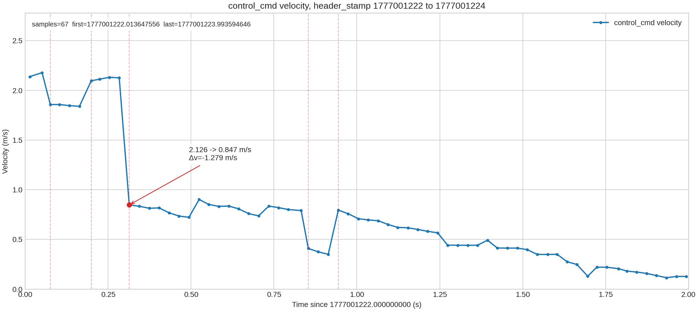
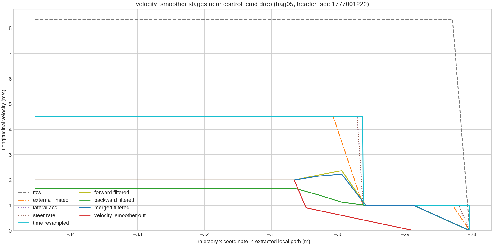
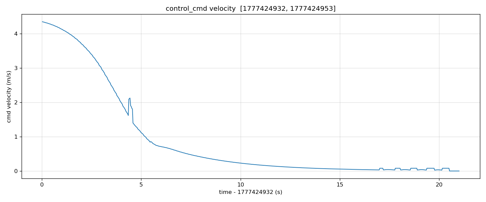
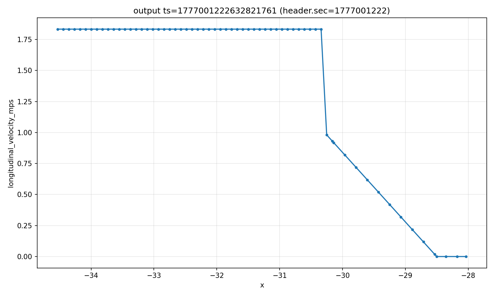

# 刹车过急问题解决记录

## 总结与反思

### 问题解决过程总结

1. 发现问题

- 测试的过程中，发现每次车辆停止的时候，最后都是"咚"的一下，突然停止，也就是急刹
- 急刹也就是速度变化的太快（速度突变），想到查看上层（autoware）发送给执行层（底盘）的速度指令，如果发送的速度指令有问题，说明问题是在上层规划控制部分
- 查看录制的rosbag包数据，打印 `/control/command/control_cmd` 话题，找到纵向速度指令为 0 的时间点 zero_vel_sec，然后查看zero_vel_sec时间点前后10S内的数据，发现速度突变发生在 2.126 -> 0.847，如下图所示



- 找到速度突变点发生的时刻 vel_jump_sec，获取 vel_jump_sec 时刻规划的轨迹话题（10HZ，理论上应该有10条），然后从 `/planning/scenario_planning/trajectory` 反向排查，定位到是 velocity_smoother 节点发出的 `/planning/scenario_planning/velocity_smoother/trajectory` 话题中最先出现速度突变，定位到节点
- 然后进入节点内部进行分析，查看节点内部的数据流向，从节点的输入（原始数据）开始逐级排查到输出（最后结果），发现突变的两个速度值 2.126 和 0.847，分别对应于QP优化前的 4.5 和 1.0,实际的突变是 4.5 -> 1.0,QP优化缓解了突变程度
- 再进入代码内部发现，1.0是 stopping_velocity 参数，overwritestoppoint()函数会将距离终点小于等于stopping_distance所有点的速度强制设置为 stopping_velocity（1.0m/s），所以会出现上一个点还是 4.5m/s，0.01m后的下一个点速度变为 1.0，QP优化无法在0.01m内插入点来平滑 4.5 -> 1.0的速度变化



- 找到问题后，解决办法有两个: 1. 修复QP优化部分的bug，车辆在速度突变点就开始逐渐减速到1.0左右，这样就不会出现突变 2. 调整 stopping_velocity 和 stopping_distance，既然突变前的速度改变不了，那就改变突变后的速度，让突变后的速度尽量接近突变前的速度，deltaT不变的情况下，减小deltaV，也能实现减缓突变，因此，将 stopping_velocity 从 1.0 m/s 增大到 1.8 m/s，同时，考虑到 stopping_velocity 的增大，在保证最大减速度不变的情况下，减速距离也要相应的加长，因此增大 stopping_distance 参数，从3.0增大到4.0

- 修改后，可以看到速度指令没有出现突变，速度是逐渐减小到 0 



### 踩的坑

1. 分析一个复杂的问题，要先从全局出发，对问题有大致的脉络，再去看细节

- 一开始的时候,只关注规划部分，只看 `planning` 相关的话题，没有去看最强相关的控制指令 `cmd` 话题以及判断位置的定位 `localization`话题

2. 对于速度指令异常这些数值敏感的问题，要使用图像来进行分析，更直观和容易发现问题

- 没有借助图像来分析，光看原始的数据，包含了太多的无用信息，导致抓不住重点，而且也不够直观，容易被淹没在细节里，通过挑出纵向速度指令来画图，一下就能找到 2.1 -> 0.8的速度突变点

## 1. 问题背景

实车测试过程中，车辆在接近目标点时出现明显的刹车过急现象。为定位问题来源，通过实车测试，保存测试日志、rosbag 包，并围绕控制指令、定位、规划轨迹和 `velocity_smoother` 内部调试话题进行回放分析。

本次问题的核心结论是：速度指令突变不是控制器本身直接产生，而是在规划链路的 `velocity_smoother` 内部形成。具体原因是 `stopping_distance` 和 `stopping_velocity` 设置不合理，导致接近停车点时速度被过早、过强地压低，最终在 `/trajectory` 和控制指令中表现为急剧降速。

## 3. 分析流程

### 3.1 从控制指令话题定位速度突变

首先查看控制输出话题 `/control/command/control_cmd` ，在 planning_control_localization_05.bag 的 rosbag 中检测到一次明显突变：

| 字段 | 数值 |
| --- | --- |
| rosbag | `log/0424/planning_control_localization_05.bag` |
| 突变前时间 | `1777001222.283448458 s` |
| 突变后时间 | `1777001222.313580751 s` |
| 时间间隔 | `0.03 s` |
| 突变前速度 | `2.125983 m/s` |
| 突变后速度 | `0.847466 m/s` |
| 速度变化 | `-1.3 m/s` |

从曲线可以看到，控制速度在突变点前约为 2.1 m/s，随后在一个控制周期内掉到约 0.8 m/s，并继续向 0 收敛。这与实车体感上的“刹车过急”一致。


### 3.2 根据时间点查看定位信息

确定突变时间后，再回到定位数据查看车辆当时所在位置和目标点距离。0424 的目标点为：

```text
goal_xy = (-28.0124, -15.4706)
```

在 1777001222.283448458 时刻，车辆的位姿为:

```text
localization_xy = (-30.936785,-17.033555)
```

### 3.3 截取突变点前后 10 秒规划数据

围绕 0424/planning_control_localization_05.bag 的突变时间 `1777001222.283448458 s`，选取前后 10 秒窗口，对 `/planning/scenario_planning/trajectory` 及其上游调试话题进行反向排查。

排查顺序不是从最终控制器开始，而是从规划最终输出 `/trajectory` 反向看每一级中间结果：

1. `/planning/scenario_planning/trajectory`
2. `/planning/scenario_planning/velocity_smoother/trajectory`
3. `/planning/scenario_planning/velocity_smoother/debug/merged_filtered_trajectory`
4. `/planning/scenario_planning/velocity_smoother/debug/backward_filtered_trajectory`
5. `/planning/scenario_planning/velocity_smoother/debug/forward_filtered_trajectory`
6. `/planning/scenario_planning/velocity_smoother/debug/trajectory_time_resampled`
7. `/planning/scenario_planning/velocity_smoother/debug/trajectory_steering_rate_limited`
8. `/planning/scenario_planning/velocity_smoother/debug/trajectory_lateral_acc_filtered`
9. `/planning/scenario_planning/velocity_smoother/debug/trajectory_external_velocity_limited`
10. `/planning/scenario_planning/velocity_smoother/debug/trajectory_raw`

这样可以判断速度是在哪一级开始变异常，而不是只看到最终 `/trajectory` 变小。

在控制突变时，直接到全局目标点的欧氏距离仍然较远，但与当前匹配规划轨迹尾点/停止点的剩余路径距离约为 `6.36 m`。因此，问题不应只按全局目标点距离判断，而要结合当前规划轨迹的局部停止点和 `velocity_smoother` 对停止点的处理逻

### 3.4 反向定位到 velocity_smoother 内部

本节使用 `log/0424/planning_control_localization_05.bag` 的数据重新分析。该 bag 的控制指令在 `1777001222` 到 `1777001224` 窗口内出现明显速度下跳：

| 字段 | 数值 |
| --- | --- |
| 分析窗口 | `1777001222.000000000 s` ~ `1777001224.000000000 s` |
| 窗口内样本数 | `67` |
| 最大速度 | `2.178113 m/s` |
| 最小速度 | `0.114850 m/s` |
| 最大单步下跳时间 | `1777001222.313580751 s` |
| 下跳前速度 | `2.125983 m/s` |
| 下跳后速度 | `0.847466 m/s` |
| 单步变化量 | `-1.278517 m/s` |
| 时间间隔 | `0.030132 s` |

随后选择控制速度下跳前最近的一组 `velocity_smoother` 内部调试轨迹进行反向对比。该组数据来自 `header_sec == 1777001222`，对应导出目录：

```text
log/0424/planning_control_localization_05.bag_logs/velocity_smoother_sec_1777001222_plots/
```

`velocity_smoother` 各阶段在控制下跳前的速度范围如下：

| 阶段 | 话题/目录 | 时间戳 ns | 点数 | 速度范围 | 最大相邻跳变 |
| --- | --- | ---: | ---: | --- | --- |
| raw | `debug/trajectory_raw` | `1777001222295063034` | 16 | `0.0 ~ 8.333333 m/s` | `8.333333 -> 0.0` |
| external limited | `debug/trajectory_external_velocity_limited` | `1777001222295099769` | 16 | `0.0 ~ 4.5 m/s` | `4.5 -> 1.0` |
| lateral acc | `debug/trajectory_lateral_acc_filtered` | `1777001222295045083` | 73 | `0.0 ~ 4.5 m/s` | `4.5 -> 1.0` |
| steer rate | `debug/trajectory_steering_rate_limited` | `1777001222294963997` | 73 | `0.0 ~ 4.5 m/s` | `4.5 -> 1.0` |
| time resampled | `debug/trajectory_time_resampled` | `1777001222295009596` | 340 | `0.0 ~ 4.5 m/s` | `4.5 -> 1.0` |
| forward filtered | `debug/forward_filtered_trajectory` | `1777001222294972413` | 51 | `0.0 ~ 2.366788 m/s` | `2.366788 -> 1.0` |
| backward filtered | `debug/backward_filtered_trajectory` | `1777001222295027547` | 51 | `0.0 ~ 1.674608 m/s` | `1.0 -> 0.0` |
| merged filtered | `debug/merged_filtered_trajectory` | `1777001222295072346` | 51 | `0.0 ~ 2.229362 m/s` | `2.229362 -> 1.0` |
| velocity_smoother out | `/planning/scenario_planning/velocity_smoother/trajectory` | `1777001222295120505` | 61 | `0.0 ~ 2.0 m/s` | `2.0 -> 0.9` |

分阶段叠加图如下：


由此可以确认：

- `raw` 阶段输入轨迹仍保留较高速度，最高约 `8.333333 m/s`，末端存在 `8.333333 -> 0.0` 的停止点跳变。
- `external limited` 阶段已经将速度上限压到 `4.5 m/s`，并在停止点前形成 `4.5 -> 1.0` 的速度台阶；这个台阶会继续传递到 lateral acceleration、steer rate、time resampled 阶段。
- QP 前后过滤阶段进一步把局部速度压低：`forward_filtered` 最高约 `2.366788 m/s`，`backward_filtered` 最高约 `1.674608 m/s`，`merged_filtered` 最高约 `2.229362 m/s`。
- 最终 `velocity_smoother` 输出最高约 `2.0 m/s`，并在末端形成 `2.0 -> 0.9 -> 0.0` 的下降趋势；这与同一时间窗口内 `/control/command/control_cmd` 从 `2.125983 m/s` 跳到 `0.847466 m/s` 的现象一致。

因此，`0424/planning_control_localization_05.bag` 的数据同样说明：急刹对应的速度下跳在控制器之前已经由 `velocity_smoother` 输出轨迹形成。问题链路不是后级控制器单独突变，而是 `velocity_smoother` 内部停止点接近速度处理与后续平滑/过滤共同作用后，把接近停止点的速度曲线压得过陡。

关键点:速度突变点就是在 `4.5 -> 1.0`，突变点之前的阶段属于正常行驶阶段，速度保持在限速 4.5 m/s，突变点之后的阶段属于stopping阶段，车辆在到达距离终点stopping_distance(3m)的点时，速度被强制设置为 1.0 m/s，然后进入QP优化阶段，突变点前的阶段速度从 4.5 m/s 优化到 2.1 m/s 左右，突变点后的速度 从1.0 m/s 优化到 0.847466 m/s，但是问题的关键在于 2.1 m/s的速度点和 0.847466 m/s的速度点距离太近，QP优化也无法实现平滑过渡，导导致速度突变，也就是急刹。 

从下面的图可以更明显的看到从 `2.125983 m/s` 到 `0.847466 m/s` 的突变，




## 4. 代码链路确认

`velocity_smoother` 的主处理链路可以概括为：

```text
onCurrentTrajectory
  -> convertToTrajectoryPointArray
  -> calcTrajectoryVelocity
       -> findNearestIndexFromEgo
       -> extractPathAroundIndex
       -> applyStopApproachingVelocity
       -> smoothVelocity
            -> applyLateralAccelerationFilter
            -> applySteeringRateLimit
            -> resampleTrajectory
            -> QP forward/backward filtering
            -> merge filtered trajectory
  -> publishTrajectory
```

关键在 `calcTrajectoryVelocity` 内部：如果轨迹存在停止点，会先调用停止点接近速度处理逻辑，将停止点前 `stopping_distance` 范围内的速度改为 `stopping_velocity`，然后再进入后续平滑和优化。若该距离过长或目标速度过高/过低不合理，就会影响后续 QP 优化，使最终输出在接近停止点时出现不符合实车舒适性的速度变化。

## 5. 根因

根因是 `stopping_distance` 和 `stopping_velocity` 参数不适合当前实车低速接近/停车场景。

原配置中：

```yaml
stopping_velocity: 0.6
stopping_distance: 3.0
```

这表示在距离停止点 3 m 范围内强制进入固定低速区。实车测试中，当当前局部轨迹剩余距离约 6.36 m 时，`velocity_smoother` 已经开始围绕停止点重构速度曲线；随后在 QP 前后速度被压到 `1.5 m/s`，并很快继续向 0 收敛。因为这个变化发生在很短时间窗口内，控制指令表现为速度突降，车辆体感为急刹。

问题的本质不是“控制器突然刹车”，而是规划输出的目标速度曲线已经发生突变，控制器只是跟随了突变后的目标速度。

## 6. 处理方案

将停止接近区缩短，并降低接近停止点前的目标速度，使车辆只在更接近目标点时进入低速收敛：

```yaml
stopping_velocity: 1.8
stopping_distance: 4.0
```

对应配置文件位置：

- `src/core/autoware_core/planning/autoware_velocity_smoother/config/default_velocity_smoother.param.yaml`
- 若实际 launch 使用 `autoware_launch` 中的覆盖参数，也需要同步检查 `src/launcher/autoware_launch/autoware_launch/config/planning/scenario_planning/common/autoware_velocity_smoother/velocity_smoother.param.yaml`

调整后的意图：

- `stopping_distance: 1.0`：因为提高了stopping_velocity，所以相应的提高stopping_distance，给予足够的距离让车辆能够缓慢减速。
- `stopping_velocity: 1.8`：提高stopping_velocity，减少最后停车阶段的速度落差。
- 保持 `velocity_smoother` 的横向加速度限制、转向角速率限制和 QP 平滑逻辑继续工作。

## 7. 复核方法

参数调整后，复核流程仍按同一套链路执行：

1. 实车测试并录制 rosbag。
2. 查看 `/control/command/control_cmd`，确认速度指令是否仍存在单周期大幅下降。
3. 以异常时间点为中心截取前后 10 秒数据。
4. 查看定位数据，确认车辆与目标点、局部轨迹停止点的关系。
5. 从 `/planning/scenario_planning/trajectory` 反向对比 `velocity_smoother` 各 debug 话题。
6. 确认速度变化是否从 `trajectory_external_velocity_limited`、QP 过滤阶段或最终后处理阶段引入。
7. 对比实车体感，确认刹车是否变得平顺。

0424 的复核记录已经证明该方法可以稳定定位到目标附近窗口，并能导出 `velocity_smoother` 各阶段图像继续分析。

## 8. 总结

本次急刹问题通过“实车测试 + rosbag 录制 + 控制指令突变检测 + 定位窗口筛选 + 规划轨迹反向排查 + velocity_smoother 内部链路对比”的方式完成定位。

最终定位结果：

```text
/control/command/control_cmd 速度突变
  <- /planning/scenario_planning/trajectory 已经突变
  <- /planning/scenario_planning/velocity_smoother/trajectory 已经突变
  <- velocity_smoother 内部停止点接近速度处理和后续 QP 平滑共同形成
  <- stopping_distance / stopping_velocity 参数不适合当前场景
```

解决方向是缩短停止接近距离、降低停止接近速度，并继续用同一套 rosbag 分析流程验证速度曲线和实车体感。
