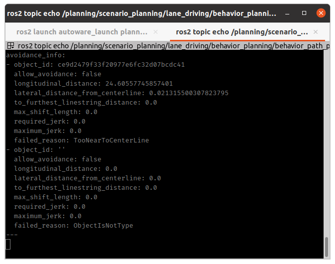

### 调试步骤

1. 检查路径是否存在

话题：ros2 topic echo /planning/path_candidate/static_obstacle_avoidance --once 2>/dev/null | head -5
可视化：

2. 查看障碍物的信息
ros2 topic echo /planning/scenario_planning/lane_driving/behavior_planning/behavior_path_planner/info/static_obstacle_avoidance --once 2>/dev/null | head -100
Type: visualization_msgs/msg/MarkerArray

ros2 topic echo /planning/scenario_planning/lane_driving/behavior_planning/behavior_path_planner/debug/avoidance_debug_message_array --once 2>/dev/null | head -200
Type: tier4_planning_msgs/msg/AvoidanceDebugMsgArray
tier4_planning_msgs/AvoidanceDebugMsg[] avoidance_info



ros2 topic echo /planning/scenario_planning/lane_driving/behavior_planning/behavior_path_planner/debug/static_obstacle_avoidance --once 2>/dev/null | grep -A 20 "text:"
Type: visualization_msgs/msg/MarkerArray

3. 由于不满足th_offset_from_centerline参数要求，判定为ambiguous_vehicle可疑车辆，wait and see而可疑车辆的规则是需要手动启动避障，所以停车等待手动批准，因此修改参数配置，减小判定阈值，更容易判断为可执行避障的物体，且自动通过审批

ros2 param get /planning/scenario_planning/lane_driving/behavior_planning/behavior_path_planner avoidance.target_filtering.parked_vehicle.th_offset_from_centerline 2>/dev/null

ros2 param set /planning/scenario_planning/lane_driving/behavior_planning/behavior_path_planner avoidance.target_filtering.avoidance_for_ambiguous_vehicle.policy "auto"

ros2 topic echo /planning/scenario_planning/lane_driving/behavior_planning/behavior_path_planner/debug/avoidance_debug_message_array --once 2>/dev/null

ros2 topic echo /planning/scenario_planning/lane_driving/behavior_planning/behavior_path_planner/debug/static_obstacle_avoidance --once 2>/dev/null | grep -E "ratio:|lateral:|clip:|stoppable:|parked|is_on"

### 障碍物位置对绕障的影响

1. 障碍物位置更靠近路边缘，更容易绕障碍或者可能不阻挡，ego直接通过

obj.kinematics.pose_with_covariance.pose.position.x = -19.8
obj.kinematics.pose_with_covariance.pose.position.y = -2.0
obj.kinematics.pose_with_covariance.pose.position.z = 4.0


### 判断障碍物为 parked_vehicle 的条件

```c++
...
    bool isParkedVehicle(
  const ObjectData & object, const std::shared_ptr<AvoidanceParameters> & parameters)
```


1. 不在交叉路口
2. shiftable_ratio 大于阈值
3. 距离中心线足够远

### wait and see 功能说明

**满足3个条件才会触发**

1. 障碍物必须是模糊车辆，模糊车辆的判断条件

停止时间 > th_stopped_time (配置为 3.0秒)
移动距离 < th_moving_distance (配置为 1.0米)
不在忽略区域内（交通灯前20米、人行横道前20米）

2. 障碍物行为属于配置的目标行为

wait_and_see:
  target_behaviors: ["MERGING", "DEVIATING"]

```c++
...
    ObjectData::Behavior getObjectBehavior(
  const ObjectData & object, const std::shared_ptr<AvoidanceParameters> & parameters)
```
返回车辆行为 none/merging/deviating

3. 距离条件判断

```c++
...
    const bool enough_distance =
  object.longitudinal < prepare_distance + constant_distance + avoidance_distance +
                        parameters_->wait_and_see_th_closest_distance;
```

只有当障碍物距离足够远，才会触发 wait and see

**结果**

1. 延迟开始绕障，插入wait点，开始等待

**配置参数位置**
<static_obstacle_avoidance.param.yaml>
wait_and_see:
  target_behaviors: ["MERGING", "DEVIATING"]  # 要等待观察的行为类型
  th_closest_distance: 10.0                    # 最近距离阈值[m]


### RTC(request to cooperate)

**触发条件**

data.request_operator == true

**rtc_interface.hpp**

1. RTC 接口使用的命名空间
std::string cooperate_status_namespace_ = "/planning/cooperate_status";
std::string cooperate_commands_namespace_ = "/planning/cooperate_commands";
std::string enable_auto_mode_namespace_ = "/planning/enable_auto_mode";

2. 状态发布: 
/planning/cooperate_status/static_obstacle_avoidance_left 和 /planning/cooperate_status/
static_obstacle_avoidance_right

3. 命令服务: 
/planning/cooperate_commands/static_obstacle_avoidance_left 和 /planning/cooperate_commands/static_obstacle_avoidance_right

# 查看左侧绕避状态
ros2 topic echo /planning/cooperate_status/static_obstacle_avoidance_left

# 查看右侧绕避状态
ros2 topic echo /planning/cooperate_status/static_obstacle_avoidance_right

# 批准左侧绕避（ACTIVATE命令）
ros2 service call /planning/cooperate_commands/static_obstacle_avoidance_left \
  tier4_rtc_msgs/srv/CooperateCommands \
  "{
    stamp: {sec: 0, nanosec: 0},
    commands: [
      {
        module: {type: 10},  // module: {type: 11} 批准右侧绕避
        command: {type: 1},
        uuid: {uuid: [你的UUID]}
      }
    ]
  }"

# 实时查看UUID
ros2 topic echo /planning/cooperate_status/static_obstacle_avoidance_left

# 输出示例：
# statuses:
# - uuid: {uuid: [12, 34, 56, 78, ...]}  # 这就是UUID
#   requested: true
#   safe: true
#   ...


### 查看有那些组件被激活
ros2 topic echo /planning/.../behavior_path_planner/debug/module_status

### 算法流程

1. 更新数据 getPreviousModuleOutput().reference_path， PreviousSplineShiftPath， PreviousLinearShiftPath // updateData
1.1 更新基础路径和目标障碍物 // fillFundamentalData
1.1.1 获取自车参考位姿和车道信息
1.1.2 根据是否存在红灯信号扩展可行驶车道
1.1.3 计算可行驶区域的边界 （data.drivable_lanes_same_direction/data.drivable_lanes）
1.1.4 重采样参考路径

1.1.5 过滤最新检测到的障碍物  // fillAvoidanceTargetObjects
1.1.5.1 基于障碍物位于车道线内/外，划分为线内/外障碍物
1.1.5.2 从线内障碍物集合过滤得到目标障碍物  // filterTargetObjects

1.1.6 补偿感知丢失的障碍物 // compensateLostTargetObjects
1.1.7 记录影响路径的障碍物，并保存到本次避让结束为止 // updateClipObject
1.1.8 计算每个障碍物可以安全减速的距离 // fillAvoidanceTargetData
1.1.9 更新存储的障碍物并将参考路径设置为基础路径 // updateStoredObjects

1.2 更新偏移线并检查安全性 // fillShiftLine
1.2.0 根据最新data，生成 AvoidOutline // generator_.update(avoid_data_, debug_data_)
1.2.1 创建候选偏移线  //     generator_.generate(data, debug)
1.2.2 验证新偏移线的有效性
1.2.3 添加新的偏移线
1.2.4 基于参考路径得到偏移路径，路径上所有点的偏移量甚至为0
1.2.5 得到候选路径  // path_shifter.generate(&spline_shift_path, true, SHIFT_TYPE::SPLINE) -> generateCandidateShiftLine(偏移线合并，去噪)

1.3 fillEgoStatus // 是一个避障决策状态机，负责在“避障 / 让行 / 停车”之间做最终决策，并处理外部强制控制与安全约束

1.4 决定是否需要执行  

1.5 得到最终的组件输出结果

### 偏移曲线生成全流程

0. 计算避障余量 avoid_margin（utils.cpp: getAvoidMargin()）

1. 计算期望偏移量 desire_shift_length（helper.hpp: getShiftLength()）再被 `max_left_shift_length` 截断

2. 生成 AvoidOutline（shift_line_generator.cpp: generateAvoidOutline()）

- al_avoid(obstacle avoid sequence)

```c++
    end_longitudinal  = object.longitudinal - front_constant_dist   // 障碍物前沿
    start_longitudinal = max(to_shift_end - avoidance_distance, 1e-3)
                       // 由纵向距离、jerk、速度约束决定从哪里开始侧移
    end_shift_length  = desire_shift_length（或 feasible_shift_length）
    start_shift_length = 当前路径在该点处的线性偏移量（通过 getLinearShift()）
```
- al_return (return phase)

```c++
    start_longitudinal = object.longitudinal + rear_constant_dist   // 障碍物后沿
    start_shift_length = al_avoid.end_shift_length（保持避障偏移）
    end_longitudinal  = start + getMaxReturnDistance(shift_length)
    end_shift_length  = 0.0（返回车道中心）
```

3. 可行性检查（get_shift_profile lambda）：

若纵向距离 has_enough_distance：直接用 desire_shift_length
否则根据 policy_lateral_margin（best_effort/reliable）决定：
计算 jerk 是否满足 → lateral_max_jerk_limit
若不满足且策略为 best_effort：用 jerk 反推可行的最大偏移量 feasible_shift_length = calc_lateral_dist_from_jerk(avoidance_distance, lateral_max_jerk, speed)

4. applyPreProcess

步骤	函数	说明
Step1	applyMergeProcess(outlines)	若相邻两 outline 的 return 段与下一 avoid 段重叠且满足 jerk 约束，合并为 middle_lines
Step2	applyFillGapProcess(outlines)	填补 avoid→middle、middle→return 之间的时序空隙
Step3	toArray()	展平为 AvoidLineArray
Step4	applyCombineProcess()	与已注册的 raw 偏移线去重合并
Step5	addReturnShiftLine()	若没有返回线，从最后一个偏移点向车道中心追加返回段
Step6	applyFillGapProcess(lines)	填补 ego→第一偏移线、相邻偏移线之间的空隙

5. 生成候选偏移线（generateCandidateShiftLine()）

步骤	函数	说明
Step1	applyMergeProcess(lines)	通过 generateTotalShiftLine() + extractShiftLinesFromLine() 重新提取梯度变化点，合并同向线
Step2	applyTrimProcess()	依次：小偏移过滤→相似梯度合并→量化→再次小偏移过滤→两次相似梯度合并，去噪
Step3	findNewShiftLine()	与已注册 shift line 对比，找出尚未注册的新偏移线输出


### 偏移曲线上的速度生成

速度插入在 updateEgoBehavior() 中按以下顺序执行：

1. insertPrepareVelocity()（避障前准备减速）
触发条件：无已批准偏移线 + 未开始偏移 + 路径有效且安全

计算流程：
min_avoid_distance = calc_longitudinal_dist_from_jerk(shift_length, lateral_max_jerk, min_speed)
remaining_distance = object.longitudinal - min_avoid_distance
decel_distance = getFeasibleDecelDistance(velocity_map.front())

// 若 remaining_distance < decel_distance：空间不足，不插入
// 否则：
v_target(x) = calc_feasible_velocity_from_jerk(
                shift_length, avoid_lateral_min_jerk, distance_to_object - x)
// 对路径上每个点 x 设置 v(x) = min(v_original, max(v_target - buf_slow_down_speed, lower_speed))

物理含义：根据需要完成的横向偏移量和纵向距离，反推最大允许纵向速度（jerk 约束投影），从障碍物前沿向后逐点写入减速速度曲线。

2. insertAvoidanceVelocity()（偏移中的加速度限制）
触发条件：有已批准的偏移线（path_shifter_.getShiftLines() 非空）

计算流程：

[distance_to_accel_end, v_max] = getDistanceToAccelEndPoint(path)
// 从 ego 到加速终点用匀加速约束限速：
v²(x) = v_max² - 2 × max_acceleration × (accel_end_dist - x)
v(x) = min(v_original, max(ego_speed, sqrt(v²(x))))

物理含义：偏移过程中，限制纵向速度不超过横向加速度允许的上限（由 max_v_point_ 记录）。

3. insert_velocity() lambda（停车/等待逻辑）
根据状态机：

状态	动作	函数
yield_required	在停止线前停车等待	insertWaitPoint()
!avoid_required	不需要避障，跳过	—
!found_avoidance_path	无可行避障路径	insertWaitPoint()
等待审批且无已注册偏移线	等待	insertWaitPoint()
路径不安全（偏移中）	在车道边界前停车	insertStopPoint()
insertWaitPoint()：在 data.to_stop_line 处插入 v=0 减速点（insertDecelPoint()）

insertStopPoint()：找到路径偏出原车道的点，在该点前停车

4. insertReturnDeadLine()（返回截止线减速）
若返回截止点距离不够远，需要在截止点前停止/减速：

to_stop_line = to_return_point - min_return_distance - buffer - stop_buffer
v_target(x) = calc_feasible_velocity_from_jerk(
                shift_length, avoid_lateral_min_jerk, to_stop_line - x)
// 对路径上每点设置 v(x) = min(v_original, max(v_target - buf, min_slow_down_speed))

### 完整数据流程图

障碍物检测
    ↓
getAvoidMargin()         ← to_road_shoulder_distance, hard/soft_margin
    ↓ avoid_margin
calcShiftLength()        ← overhang_dist
    ↓ desire_shift_length（被 max_left/right_shift_length 截断）
generateAvoidOutline()   ← 纵向距离、jerk限制、速度
    ↓ AvoidOutlines (al_avoid + al_return)
applyPreProcess()        ← 合并、填缝、去重
    ↓ raw_ (AvoidLineArray)
generateCandidateShiftLine() ← 合并、去噪、提取新线
    ↓ new_shift_line
PathShifter::generate()  ← reference_path + shift_lines → spline插值横向偏移
    ↓ shifted_path (位置已偏移，速度来自上游)
updateEgoBehavior()
    ├─ insertPrepareVelocity()   → 基于jerk约束，减速到偏移前准备速度
    ├─ insertAvoidanceVelocity() → 基于加速度约束，偏移中速度上限
    ├─ insertWaitPoint/StopPoint → 无法避障时停车
    └─ insertReturnDeadLine()    → 返回截止点前减速/停车


### 生成偏移曲线的时候，偏移量尽可能的大

#### 偏移量的决定流程

1. getAvoidMargin() 计算避障余量 = min(soft_lateral_distance_limit, max_avoid_margin)

2. calcShiftLength() = overhang_dist ± avoid_margin

3. getShiftLength() 再被 max_left/right_shift_length 限制

当前的关键限制在于 getAvoidMargin() 的 Step3 用了 min(soft_lateral_distance_limit, max_avoid_margin)，这意味着即使道路空间充足，偏移也只会偏移到 hard_margin + soft_margin + 0.5*vehicle_width 的程度。

要让偏移量尽可能大，需要修改代码让它直接使用道路可用空间的上限(soft_lateral_distance_limit)，而不是被 max_avoid_margin 封顶。

### 判断是否为车辆类型（除开PEDESTRIAN和BICYCLE的所有类型都是）

bool isVehicleTypeObject(const ObjectData & object)
{
  const auto object_type = utils::getHighestProbLabel(object.object.classification);

  if (object_type == ObjectClassification::PEDESTRIAN) {
    return false;
  }

  if (object_type == ObjectClassification::BICYCLE) {
    return false;
  }

  return true;
}